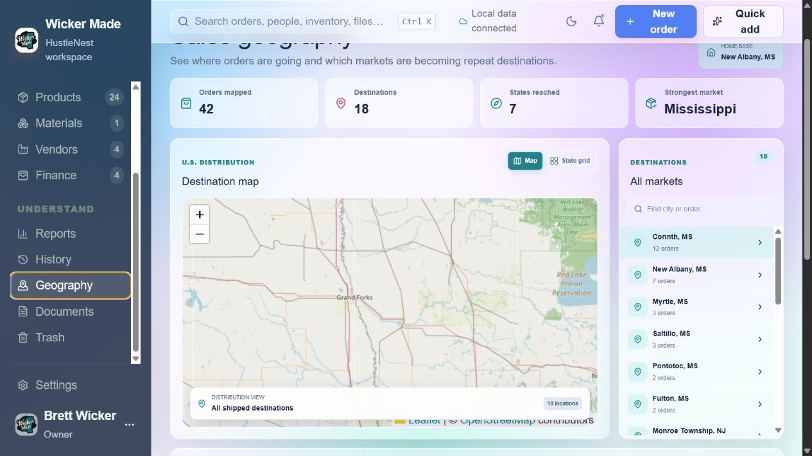

# HustleNest

Version: **v4.1**

HustleNest is a local-first business workspace with a browser interface and a Python backend. It brings orders, customers, inventory, vendors, finance, reports, documents, and settings into one smooth workflow while keeping business data in a local SQLite database.



## Highlights

- Connected browser workspaces for orders, customers, products, materials, vendors, finance, reports, history, geography, documents, trash, and settings.
- Local SQLite storage, automatic backups, guarded restore, CSV/XLSX import, and optional cloud synchronization.
- Global search, Quick Add, workflow shortcuts, revision-safe editing, and branded invoice and report exports.
- Six persistent themes, adjustable text size, editable business identity, and owner profile controls.
- Interactive sales geography with all shipped destinations shown together on an OpenStreetMap view.
- Configurable browser launch behavior: system default, a selected work browser, or manual opening.

## What's New in 4.0

- **Browser-first application**: The Windows launcher now starts the production browser workspace and local backend together.
- **Complete workflow migration**: Core sales, CRM, inventory, finance, reporting, document, trash, backup, import, cloud-sync, and settings workflows are available in the browser.
- **Refined appearance**: Light, Dark, Minty, Solar, Mission Control, and Glass themes plus application-wide text scaling.
- **Business identity controls**: Edit the owner profile, avatar, business details, and logo directly in Settings.
- **Destination map**: View every shipped destination at once, with market summaries and direct order navigation.
- **Data completeness and reliability**: Historical order-only customers remain visible, stale edits are guarded, and material creation no longer fails with the `12 values for 13 columns` database error.

## Installation

### Option 1: Windows Installer (recommended)

1. Download `HustleNestSetup.exe` from the latest release (or use the build/HustleNestSetup.exe artifact when building locally).
2. Run the installer and follow the prompts. The default location is `C:\Program Files\HustleNest`.
3. Launch HustleNest from the Start menu or the optional desktop shortcut.

### Option 2: Run from source

Windows 10 or later with Python 3.11 and Node.js 22 is required when running from source.

```powershell
py -3.11 -m venv .venv
.\.venv\Scripts\Activate.ps1
pip install -r requirements.txt
cd web
npm install
npm run build
cd ..
python -m hustlenest.browser_app
```

On first run a database file appears at `%LOCALAPPDATA%\HustleNest\hustlenest.db`. Deleting that file resets all application data.

## Running the App

- Installer build: launch HustleNest from Start > HustleNest > HustleNest.
- Source build: run `python -m hustlenest.browser_app` after building the browser workspace.

Invoices export as PDFs through the Invoice Manager dialog, which launches when you select an order and choose **Export Invoice**.

## Running Tests

Run the repository regression tests with Python's standard test runner:

```powershell
python -m unittest discover -s tests -v
```

The planned workflow and browser-UI migration are documented in
[`docs/UX_MIGRATION_BLUEPRINT.md`](docs/UX_MIGRATION_BLUEPRINT.md). The completed
desktop-to-browser mapping and safe retirement checklist are in
[`docs/BROWSER_PARITY_AND_RETIREMENT.md`](docs/BROWSER_PARITY_AND_RETIREMENT.md).

The browser Orders workspace lives in [`web/`](web/). Phase 3 connects its
list, detail, metrics, status advancement, customer/product lookup, and complete
order creation/editing workflow to the existing local SQLite repositories.
Orders can also be marked paid or unpaid, cancelled with inventory restoration,
and downloaded as branded PDF invoices or receipts directly from the browser
through `python -m hustlenest.web_bridge`. When that
local bridge is unavailable or the database is empty, the UI clearly falls
back to sample data for workflow review. The integration boundary is documented in
[`docs/ORDERS_BRIDGE_CONTRACT.md`](docs/ORDERS_BRIDGE_CONTRACT.md).

The first Phase 4 module workspaces add connected Customers and Products
list/detail views. Related orders open directly in the Orders workspace, and a
customer or product can seed a new order without re-entering its context.
Customer details also support interaction logging, related-order context, and
next-follow-up scheduling directly from the browser.
Customer results merge CRM contacts with distinct names found in historical
orders, ensuring order-only customers remain visible. An order-only customer can
be promoted into an editable CRM contact directly from the detail view. The connected Materials
workspace adds stock thresholds, inventory value, vendors, and recent material
transactions. Materials can be received, consumed, or corrected from a physical
count in the browser while preserving an auditable inventory history.
The Vendors workspace completes that supply chain view with contact and account
details, linked-material value, reorder exposure, and direct material navigation.
The Finance workspace adds a connected review surface for recorded expenses,
year-to-date category trends, upcoming recurring obligations, and operational
losses linked back to products, materials, and orders.
The Reports workspace combines sales, line-item costs, expenses, losses,
fulfillment, products, and customers into period-based operating insights.
History adds a searchable, date-filtered audit trail for order changes,
payments, status updates, and financial deltas, with CSV export and direct
navigation back to available orders. The same timeline appears inside each
order detail view.
Sales Geography includes an interactive OpenStreetMap view that displays every
shipped destination together, plus an offline-friendly state grid, home-base
context, destination rankings, city search, and direct links to market orders.
Home now acts as a connected command center for attention items, cash outlook,
sales momentum, goals, recent orders, and direct workflow shortcuts.
Goals can be created and edited from Home with automatic business metrics or
manual progress, dated checkpoints, thresholds, ownership, and stale-edit
protection. Obsolete goals can also be removed without returning to the desktop UI.
The Documents workspace organizes local file records by category, tags, and
the orders, customers, products, materials, or vendors they support.
Files can now be uploaded into HustleNest-managed local storage, downloaded,
relinked, retagged, and removed from the browser. Removing an external file
record never deletes the source file; managed uploads offer an explicit choice.
Settings provides privacy-safe browser editing for business, order, invoice,
tax, inventory, invoice payment methods, and launch preferences with validation
and conflict protection. Existing payment destinations remain masked and can
be retained, replaced, added, or removed without being returned to the browser.
Cloud credentials and provider values remain protected. Start the bridge with
`--launch-browser` to honor the saved choice
of system default, a selected installed work browser, or manual opening.
For a single source command after `npm run build`, use
`python -m hustlenest.browser_app`; it starts the production browser server and
Python backend together and applies the same saved browser choice.
Cloud sync can now be fully configured in Browser Settings for local folders,
Google Drive, Dropbox, OneDrive, or SFTP. Saved values never return to the
browser; each field can be kept, replaced, or removed. Manual uploads use a
consistent SQLite snapshot. Pulls require typed confirmation, create a local
safety backup, validate the downloaded database, and request a restart only
when local data was actually replaced.
The global Quick Add panel creates customers, products, materials, vendors,
expenses, recurring expenses, and losses from any browser workspace, then
refreshes and opens the affected module. Finance can also revise recurring
schedules with conflict protection. Orders retain their more detailed dedicated
composer.
The header search now finds records across sales, inventory, finance, and
documents, and opens the selected record directly. Use `Ctrl+K` to focus it
from anywhere in the browser workspace.
Customers, products, materials, and vendors can also be edited from their
browser detail views. Updates retain advanced fields managed elsewhere and use
revision checks to prevent stale forms from overwriting newer changes.
Product editing now includes lifecycle status and itemized extra unit costs;
the Products workspace shows total-cost composition, margin, sales velocity,
and projected stockout timing from the existing inventory forecast service.
PNG, JPEG, GIF, and WebP product photos can be uploaded, previewed, replaced,
or removed in the browser. Images are validated by file signature, limited to
8 MB, and copied into HustleNest-managed local media storage.
Recorded expenses and operational losses can be corrected from Finance with the
same safeguards while retaining tags and linked business-record context.
Browser Settings now includes local database backup configuration, automatic
daily or weekly snapshots while the backend is running, retention limits,
manual backup/download, and guarded restore. Restores validate SQLite health,
create a safety snapshot, and require the full backup filename to be typed.
The browser can also preview and import CSV or XLSX files for products, orders,
and customers. Column mapping is editable before saving, required fields are
checked, duplicates can be skipped or updated, and unmapped existing data is
preserved during updates. The desktop wizard remains available as a fallback.
Appearance settings now persist light or dark mode across browser sessions and
support managed business-logo upload, replacement, and removal. The selected
business identity appears in browser navigation, while the desktop dashboard's
section visibility and collapsed-state preferences remain browser-editable
during the parity-verification period.
Orders and products can now be moved to trash from their browser detail views.
The Recently Deleted workspace supports search, filtering, restoration, guarded
permanent deletion, and typed confirmation before emptying all trash. Order
deletion remains separate from cancellation so inventory changes are explicit.
Reports now download order-detail CSV, tax CSV/PDF, and sales, inventory,
profit-and-loss, customer, and comparison PDFs for the selected period. Browser
editors provide confirmed, revision-guarded deletion for customers, materials,
vendors, expenses, recurring expenses, losses, and CRM interactions. Settings
also includes application version, source, and release links.

## Cloud Sync (Optional)

HustleNest can mirror its local SQLite database to a shared folder, personal Google Drive, Dropbox, Microsoft OneDrive, or a self-hosted SFTP destination. Open **Settings › Open Cloud Sync Settings…** to enable the feature:

- Enable periodic cloud sync, choose a provider, and set the interval (default five minutes).
- **Local Folder (sync client)**: Pick a directory (for example `C:\\Users\\<you>\\Documents\\HustleNestDB`) that is kept in sync by another tool such as Google Drive, OneDrive, Dropbox, or a network share. Set an optional remote file name if you do not want to use the default `hustlenest.db`.
- **Personal Google Drive**: Provide the OAuth client secrets JSON, run **Authorize Google Drive** to generate a token JSON, and optionally set the Drive folder ID and remote file name.
- **Dropbox**: Supply a long-lived access token and the remote path (for example `/Apps/HustleNest/hustlenest.db`).
- **Microsoft OneDrive**: Enter the MSAL application client ID, client secret, tenant (`consumers` for personal accounts), refresh token, and the remote path to the database.
- **Self-Hosted SFTP**: Enter the host, port, username, and either password or private key path plus the remote file location (ideal for a TrueNAS or other home server).

Use **Pull Latest** or **Upload Now** for on-demand transfers. When enabled, HustleNest downloads the newest database on startup, uploads every configured interval, and performs a final upload during shutdown. Optional provider packages (google-auth-oauthlib, dropbox, msal, paramiko) are listed in [requirements.txt](requirements.txt).

## Building From Source

To recreate the distributable artifacts:

```powershell
.\.venv\Scripts\python.exe -m PyInstaller HustleNest.spec
"C:\\Program Files (x86)\\Inno Setup 6\\ISCC.exe" installer\HustleNest.iss
```

The PyInstaller step emits the executable in `dist\HustleNest\HustleNest.exe`. The Inno Setup compiler produces `build\HustleNestSetup.exe`.

## Project Structure

```
.github/
hustlenest/
   __init__.py
   main.py                # PySide6 application entry point
   resources.py           # Resource lookup helpers
   versioning.py          # Centralized application version constant
   data/
      database.py         # SQLite bootstrap and helpers
      order_repository.py # Persistence and reporting queries
      product_repository.py
      settings_repository.py
   models/
      order_models.py     # Dataclasses for orders, items, and app settings
   services/
      order_service.py    # Business logic for invoices and analytics
      cloud_sync_service.py
   ui/
      main_window.py      # Main window with dashboard, orders, reports
      cloud_sync_dialog.py
      product_manager.py
      invoice_manager.py
      cost_component_dialog.py
   viewmodels/
      table_models.py
installer/
   HustleNest.iss         # Inno Setup script
requirements.txt
README.md
```

## Troubleshooting

- If the installer reports missing prerequisites, ensure the Visual C++ redistributables are present (PySide6 bundles the required runtime in the installer build).
- When running from source, verify the virtual environment is active before installing dependencies or launching the app.
- Delete `%LOCALAPPDATA%\HustleNest\hustlenest.db` if you need a clean slate for testing.

## License

This project currently has no explicit license. Add one if you plan to distribute the application.
